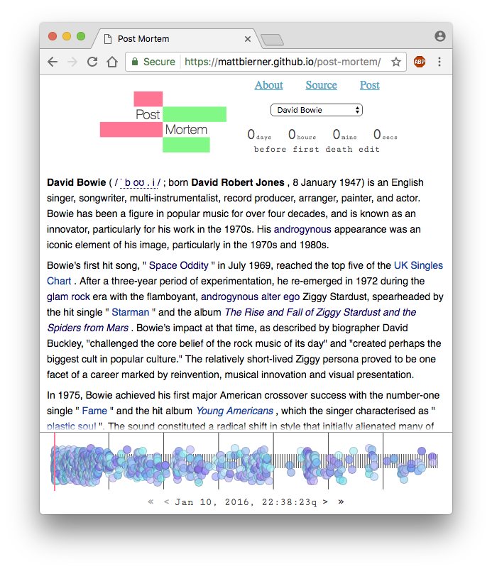
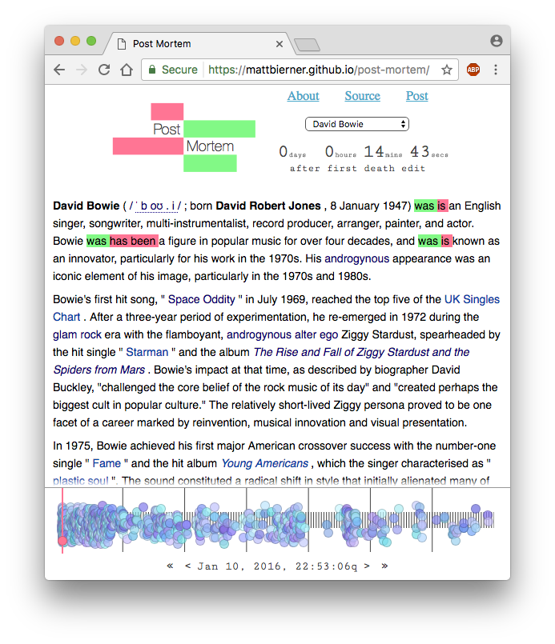
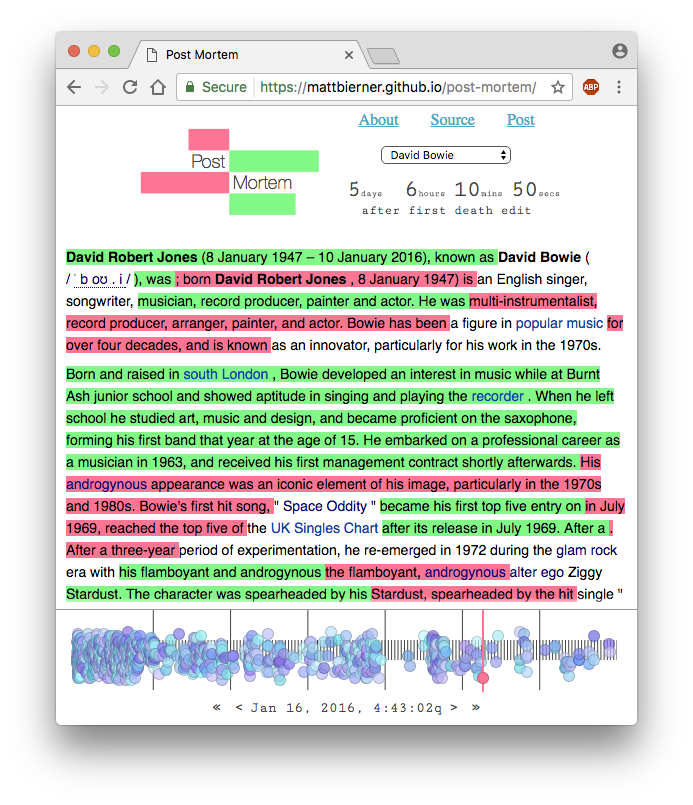

<div align="center">
    
</div>

<div align="center">
    <p><a href="https://mattbierner.github.io/post-mortem/">Site</a></p>
    <p><a href="http://blog.mattbierner.com/post-mortem">Post</a></p>
</div>


# About
*Post Mortem* is a small project that examines how a person's Wikipedia page changes in the week following their death. My initial interest was in the transaction from present to past tense, but it is also interesting to look at how shared knowledge evolves following an event. 

The site allows you to explore data for 12 people, everyone from George Harrison—who died less than a year after Wikipedia started—to Luc Coene—an Belgian economist who died in January 2017 and whose name I picked at random.



The site initially shows the contents of each person's Wikipedia page before the first edit reporting their death was made. Use the timeline at the bottom of the screen to scrub through revisions in the week following the first death edit. Additions to the page are shown in green while deletions are shown in red.



The number of changes to the page increases with time. 



A few points I found it interesting to look at:

- The initial flurry of revisions. These often revert the page to its pre-death state because the person's death has not been officially confirmed.
- Which sections of the page are revised or not.
- The evolution of Wikipedia. George Harrison's death in 2001 has only a handful of edits vs. Prince who accumulated 1100+ edits after his 2016 death.
- How vandalism is handled

Only the main contents of the page are shown. Changes to references or to the info box are not included. This means that not every revision may result in a change to displayed page contents.

# Code
The `master` branch contains the python scripts used to collect the Wikipedia data and generate the diffs while the `gh-pages` branch has the code used for the website

### Generating Diff Data
A set of python scripts that:

- Get basic revision info for the week following a person's death
- Download and scrub the wikipedia page html to only include main content
- Generate diffs from each revision against the original contents

To get started, run:

```bash
pip install
```

The `main.py` scripts does all the above steps automatically. 

```
python scripts/main.py --name "Donna Summer" --base 493040889 --first 493040905 --outdir ./data/
```

- `name` - Title of the wikipedia page to collect data from
- `base` - Starting revision. This should be the first revision before the person's death is reported. Used as the baseline for the diffs
- `first` - First revision that reports that person's death. A weeks worth of revisions will be collecting from this point
- `outdir` - File to write results to 

The main generated data of interest are in `OUTDIR/revisions/` which is a json file of basic revision data and `OUTDIR/diff/` which contains diff files of each revision against `base`


# License
Scripts and website under MIT license

All page content source from Wikipedia and licensed under its original terms